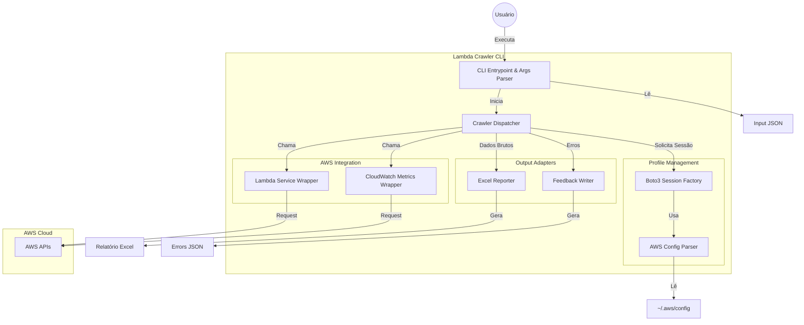

# Arquitetura de Componentes

## Visão Geral
A solução será um utilitário CLI em Python estruturado em camadas lógicas para garantir separação de responsabilidades, testabilidade e facilidade de manutenção. Não haverá microsserviços; será um monólito modular executado localmente.

## Diagrama de Containers (C4 Level 2)

## Descrição dos Componentes

### 1. Core / Entrypoint
- **`main.py`**: Ponto de entrada. Gerencia o parsing de argumentos (`argparse`), configuração de logging e tratamento de exceções globais.
- **`orchestrator.py`**: Controlador principal. Loop sobre a lista de lambdas, gerencia o estado global (sucesso/falha) e coordena chamadas aos serviços.

### 2. Services (Domínio)
- **`aws_service.py`**: Encapsula a lógica de negócio AWS.
  - `get_lambda_details()`: Obtém LastModified e Triggers.
  - `get_invocation_metrics()`: Consulta CloudWatch para somar invocações.
- **`profile_service.py`**: Lógica para mapear `AccountID` -> `ProfileName` lendo o arquivo de config.

### 3. Adapters (Infraestrutura)
- **`excel_adapter.py`**: Abstração sobre `pandas` ou `openpyxl` para criar o relatório multi-abas.
- **`storage_adapter.py`**: Leitura de JSON de entrada e escrita de JSON de erros.

### Dependências Externas
- **Boto3**: SDK AWS padrão.
- **Pandas/OpenPyXL**: Manipulação de planilhas.
- **Click/Argparse**: Interface CLI.
