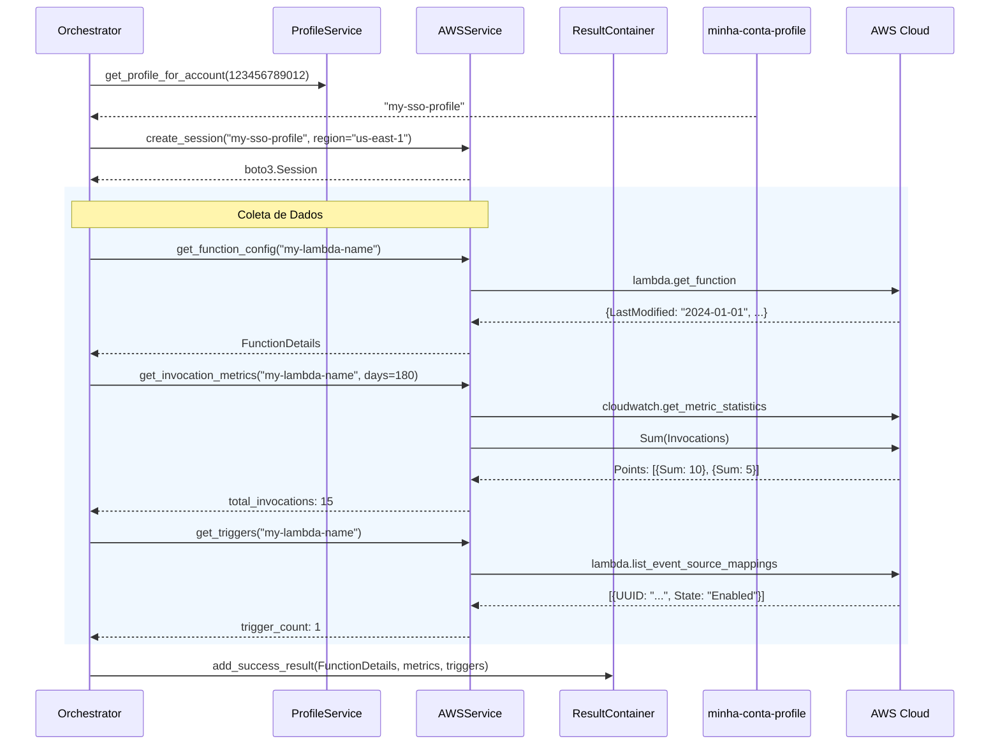

# Diagramas de Sequência

## Processamento de um Único Item (Happy Path)

```mermaid
sequenceDiagram
    participant Orch as Orchestrator
    participant Prof as ProfileService
    participant AWS as AWSService
    participant Res as ResultContainer

    Orch->>Prof: get_profile_for_account(123456789012)
    minha-conta-profile-->>Orch: "my-sso-profile"
    
    Orch->>AWS: create_session("my-sso-profile", region="us-east-1")
    AWS-->>Orch: boto3.Session
    
    rect rgb(240, 248, 255)
    Note over Orch,AWS: Coleta de Dados
    Orch->>AWS: get_function_config("my-lambda-name")
    AWS->>AWS Cloud: lambda.get_function
    AWS Cloud-->>AWS: {LastModified: "2024-01-01", ...}
    AWS-->>Orch: FunctionDetails
    
    Orch->>AWS: get_invocation_metrics("my-lambda-name", days=180)
    AWS->>AWS Cloud: cloudwatch.get_metric_statistics
    AWS->>AWS Cloud: Sum(Invocations)
    AWS Cloud-->>AWS: Points: [{Sum: 10}, {Sum: 5}]
    AWS-->>Orch: total_invocations: 15
    
    Orch->>AWS: get_triggers("my-lambda-name")
    AWS->>AWS Cloud: lambda.list_event_source_mappings
    AWS Cloud-->>AWS: [{UUID: "...", State: "Enabled"}]
    AWS-->>Orch: trigger_count: 1
    end
    
    Orch->>Res: add_success_result(FunctionDetails, metrics, triggers)
```
