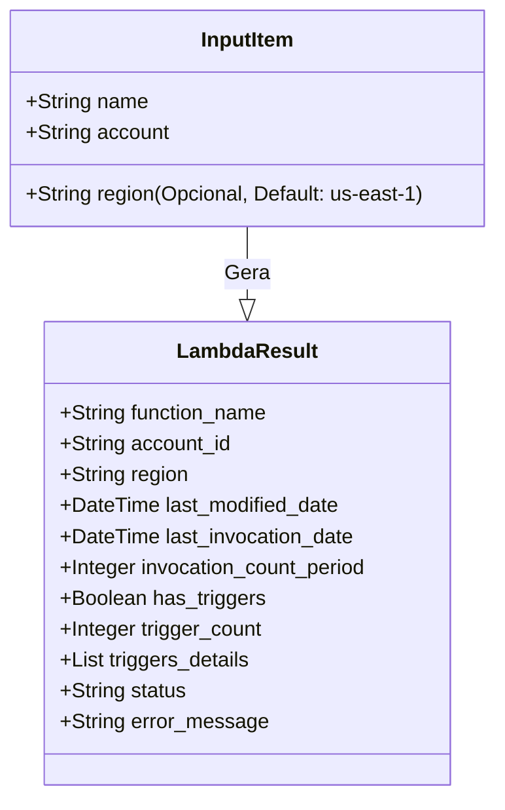

# Modelo de Dados

## Entidades Principais (Diagrama de Classe Conceitual)



## Estrutura do Excel (Output)

O arquivo Excel gerado (`lambda_audit_report.xlsx`) seguirá a seguinte estrutura:

### Abas de Conta (`Account 123456...`, `Account 987654...`)
| Function Name | Region | Last Modified | Last Invocation | Invocations (X Days) | Has Triggers? | Trigger Count |
|:---|:---|:---|:---|:---|:---|:---|
| my-function-a | us-east-1 | 2024-01-15T10:00:00 | 2024-02-01 | 150 | YES | 2 |

### Aba de Exceções (`Exceptions`)
| Function Name | Account ID | Region | Error Type | Error Message | Timestamp |
|:---|:---|:---|:---|:---|:---|
| my-function-b | 123456789012 | us-east-1 | ResourceNotFound | Function not found: ... | 2024-02-04 10:00:00 |

## Estrutura JSON (Input/Error)

### `input.json`
```json
[
  {
    "name": "my-lambda-finops-v1",
    "account": "123456789012"
  }
]
```

### `errors.json` (Para Retry)
O formato deve ser idêntico ao input para facilitar o reuso direto.
```json
[
  {
    "name": "my-lambda-fail",
    "account": "123456789012",
    "_error_metadata": "Access Denied" 
  }
]
```
